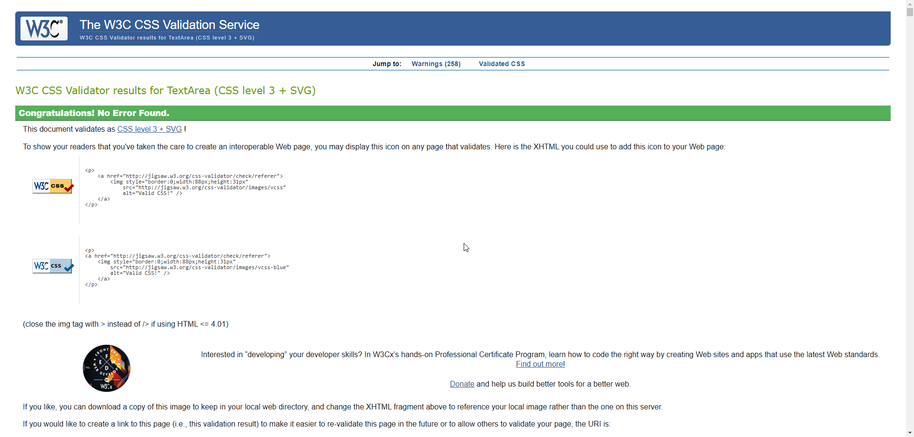

# TempLoad

**Developer:** [Your Name]

## Live Website

[Link to live website](https://tempload-045b839f4f1c.herokuapp.com/)

## Purpose of the Project

Welcome to TempLoad!

At TempLoad, we aim to provide a wide variety of high-quality templates for tools like Notion, Excel, Word, PowerPoint, websites, and more. Our mission is to streamline your workflow and enhance productivity with easy-to-use templates tailored to meet various needs.

## Table of Contents

- [User Experience (UX)](#user-experience-ux)
- [Key Project Goals](#key-project-goals)
- [Target Audience](#target-audience)
- [User Requirements and Expectations](#user-requirements-and-expectations)
- [Features](#features)
- [Design](#design)
- [Database Schema](#database-schema)
- [Technology Used](#technology-used)
- [Testing](#testing)
- [User Testing](#user-testing)
- [Responsiveness](#responsiveness)
- [Deployment](#deployment)

## User Experience (UX)

- **Purpose:** Provide users with access to a variety of templates for enhancing productivity and improving organization.
- **Features:** Browsing templates, user profiles, purchasing options, and community engagement.

## Key Project Goals

1. **To Offer Quality Templates:** Provide users with an extensive library of templates for various applications.
2. **To Enhance Productivity:** Help users save time and improve efficiency with ready-to-use templates.
3. **To Build a Community:** Foster user interaction through comments, ratings, and user profiles.
4. **To Provide a User-Friendly Experience:** Ensure easy navigation and accessibility across devices.

## Target Audience

- **Professionals:** Individuals looking for templates to enhance productivity in their work.
- **Students:** Users seeking templates for academic purposes.
- **Creatives:** Users wanting customizable templates for personal projects.

## User Requirements and Expectations

- **Template Access:** Users expect to easily browse and access a variety of templates.
- **Interactive Features:** Users want to rate, comment on, and share templates.
- **Community Engagement:** Users anticipate engaging with other template users and sharing their own templates.

## Features

#### Navigation Bar

#### Mailchimp Newsletter

#### Footer

#### Notification

## Design

#### Colour Design

Utilization of vibrant and inviting colors.

#### About Page

#### All Products Page

#### Search

#### Notion Page

#### Excel Page

#### Product Detail Page

#### Login Page

#### Register Page

#### Update Account Page

#### Shipped Page

#### Not Shipped Page

#### Cart Summary Page

## Database Schema

#### Database Structure

## Testing

### HTML Validation

All HTML pages were tested with the [W3C HTML Validator](https://validator.w3.org/).

#### HTML Result

| page  | validator                                                                                          | result |
| ----- | -------------------------------------------------------------------------------------------------- | ------ |
| Home  | 

Home Page

   | PASS   |
| About | 

About Page

 | PASS   |

### CSS Validation

Custom CSS was validated using the [W3C CSS Validator](https://jigsaw.w3.org/css-validator/).

#### CSS Result

| page | validator                                                                                        | result |
| ---- | ------------------------------------------------------------------------------------------------ | ------ |
| Css  | 

style.css

 | PASS   |

### JS Validation

JavaScript code was validated using [JSHint Validator](https://jshint.com/).

#### JS Result

| page            | validator                                                                                             | result |
| --------------- | ----------------------------------------------------------------------------------------------------- | ------ |
| script.js      | 

script.js

    | PASS   |

## User Testing

Functionality Testing: Ensured all features work as expected, including template browsing, comment submissions, and user profile management.

## Responsiveness

All pages on the website were tested for responsiveness across multiple devices. All pages display correctly on all devices tested.

## Devices used for testing, OS and Browsers:

- iPhone (various models)
- Android Smartphones (various models)
- Windows OS (Windows 10 and 11)
- Mac OS (tested using MacBook Air)
- Browsers: Chrome, Firefox, Safari, Edge, Opera

## Deployment

### Pre Deployment

- Ensure the `requirements.txt` file is up to date for all imported modules.
- A `Procfile` is required for configuring Heroku deployment to a web app.
- Configure the `ALLOWED_HOSTS` list in `settings.py` for proper deployment.

### Deploying with Heroku

1. Create a New App on Heroku.
2. Connect to GitHub.
3. Configure Deployment Settings.
4. Set Buildpacks for Node.js and Python.
5. Deploy Your App.

The live link for this project can be found here - [TempLoad](https://tempload-045b839f4f1c.herokuapp.com/)

## Credits

### Code

Inspired by various template repositories and tutorials, with custom modifications to suit the theme of TempLoad.

## Technology Used

- **Languages and Frameworks:**
  - HTML5, CSS, JavaScript, Django, JQuery, Python.
- **Database:**
  - PostgreSQL.
- **Tools and Services:**
  - GitHub, Heroku, AWS.

### Technologies and tools:

- [GitHub](https://github.com/) for repository management.
- [Git](https://git-scm.com/) for version control.
- [Heroku](https://id.heroku.com/login) for deployment.
- [Lucidcharts](https://www.lucidchart.com/pages/) for diagrams.
- [Prettier](https://prettier.io/) for code formatting.
- [Bootstrap](https://getbootstrap.com/) for responsive design.
- [Google Fonts](https://fonts.google.com/) for typography.
- [Font Awesome](https://fontawesome.com/) for icons.
- [Google Chrome Developer Tools](https://developer.chrome.com/docs/devtools/overview/) for debugging and testing.
- [SourceTree](https://www.sourcetreeapp.com/) as a Git client.
- [W3C Markup Validator](https://validator.w3.org/) for HTML validation.
- [Jigsaw CSS Validator](https://jigsaw.w3.org/css-validator/) for CSS validation.
- [JS Hint](https://jshint.com/) for JavaScript validation.
- [Django Summernote](https://pypi.org/project/django-summernote/) for rich text editing.
- [Django Crispy Forms](https://pypi.org/project/django-crispy-forms/) for form styling.

---
